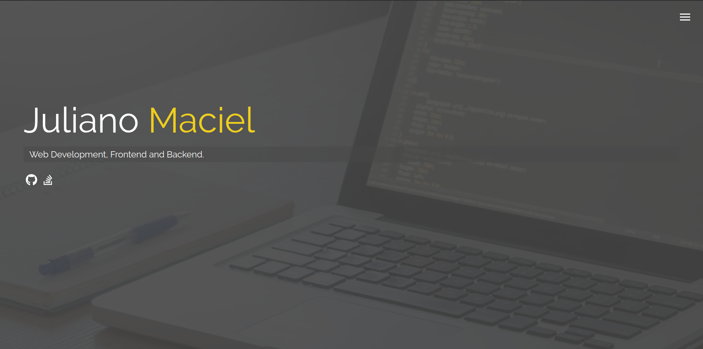
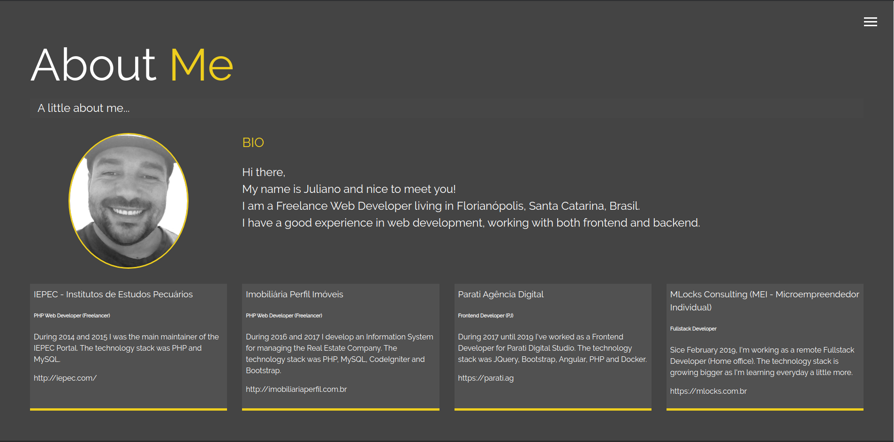
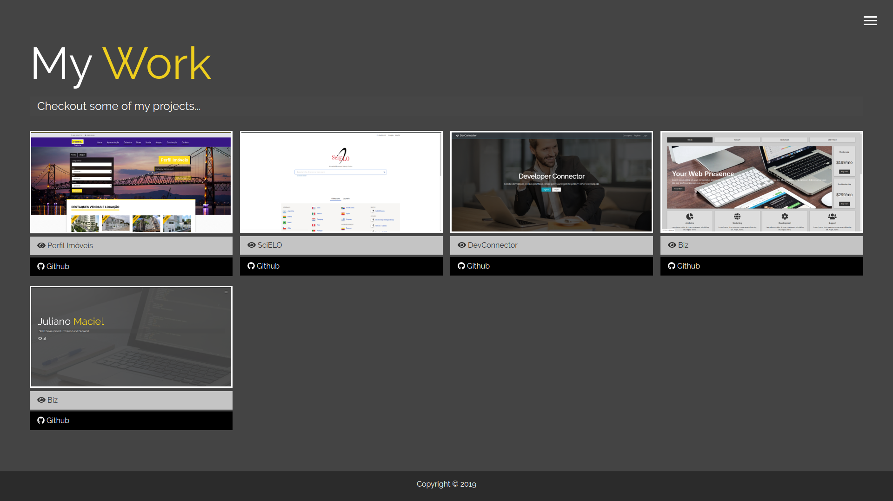
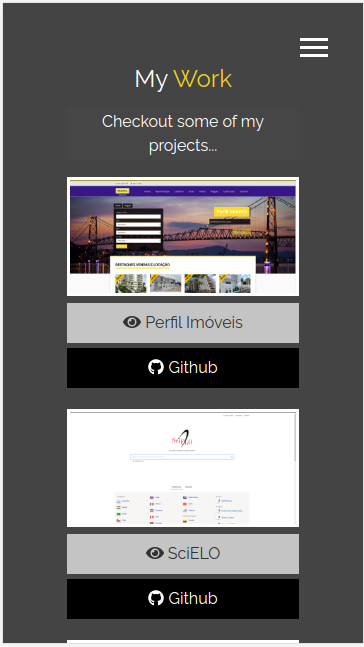

# MLocks Consulting Website

This is my professional personal website [http://mlocks.com.br](http://mlocks.com.br).

The icons are from the Font Awesome&trade; [https://fontawesome.com/](https://fontawesome.com/) library.

The images were downloaded from Pexels™ [https://www.pexels.com/](https://www.pexels.com/) - The best free stock photos & videos shared by talented creators.

## Install Dependencies

**1. Check if you have a recent version of [Node.js](https://nodejs.org/) (which comes bundled with [npm](https://www.npmjs.com/), a JavaScript package manager):**

```bash
$ node -v
```

```bash
$ npm -v
```

**2. In the _project root directory_ install all the dependencies and libs:**

```bash
$ npm install
```

## Start webpack-dev-server

**1. Run the following command:**

```bash
$ npm run start
```

**Or to generate all the bundle:**

```bash
$ npm run build
```

The files will be created in the folder **/dist**.

**2. And then access [http://localhost:8080/](http://localhost:8080/) on your browser (it's setup to open automatically).**

# Screenshots










# References

- Font Awesome&trade;: [https://fontawesome.com/](https://fontawesome.com/)

- Pexels&trade;: [https://www.pexels.com/](https://www.pexels.com/)

- Sass&trade;: [https://sass-lang.com/](https://sass-lang.com/)

- Webpack&trade;: [https://webpack.js.org/](https://webpack.js.org/)

- Traversy Media&trade; youtube channel: [https://www.youtube.com/channel/UC29ju8bIPH5as8OGnQzwJyA](https://www.youtube.com/channel/UC29ju8bIPH5as8OGnQzwJyA)

- Traversy Media&trade;: [https://www.traversymedia.com/](https://www.traversymedia.com/)

# License

Please see the [license agreement](https://github.com/julianomacielferreira/mlocks-website/blob/master/LICENSE).
